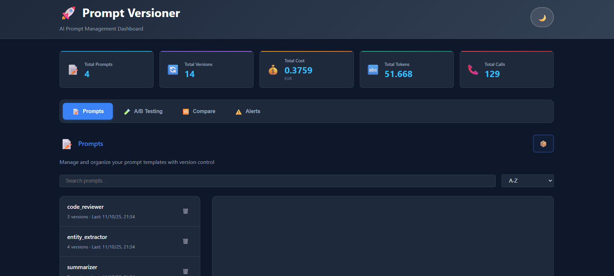
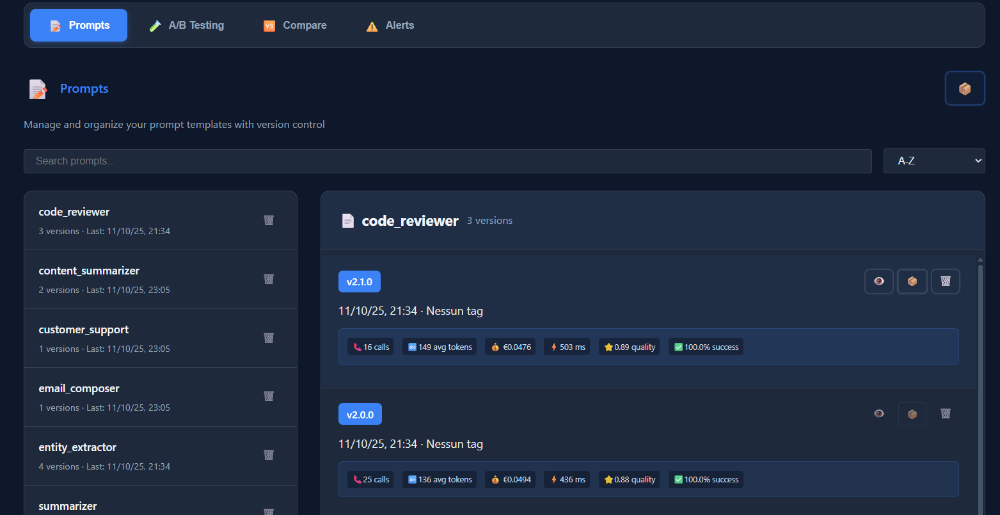
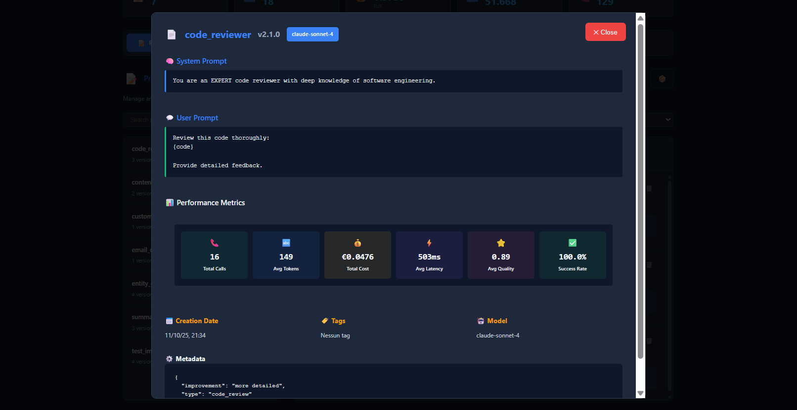
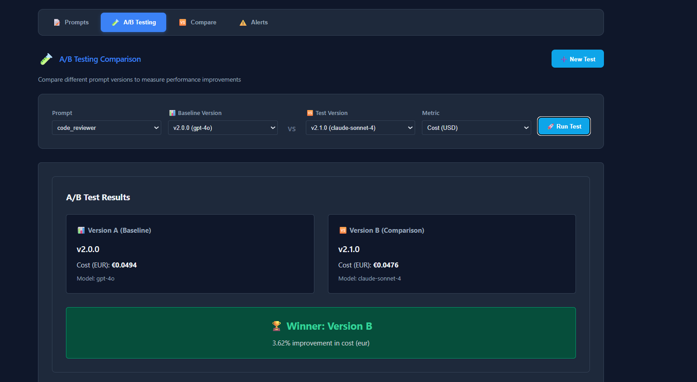
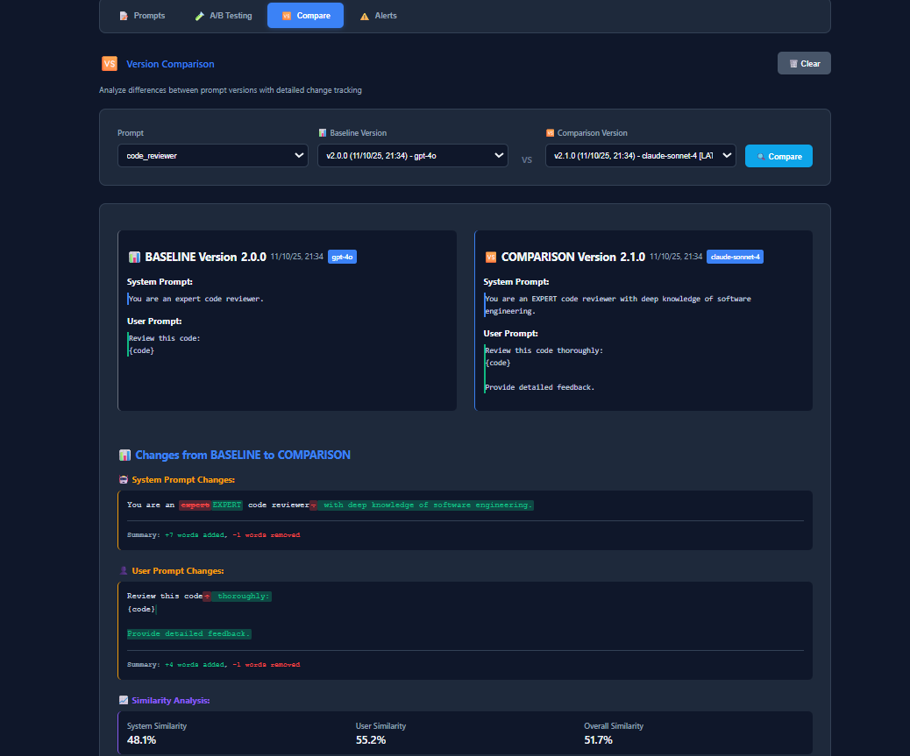
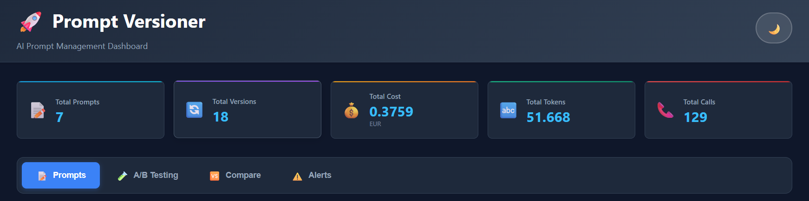
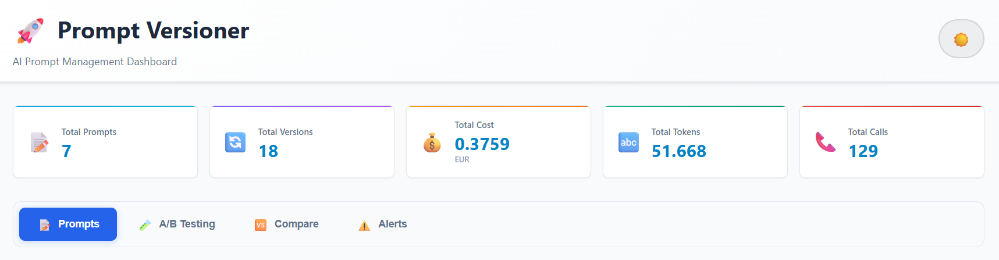

# 🚀 Prompt Versioner

<div align="center">


**A comprehensive Python library for managing, versioning, and monitoring AI prompt performance with built-in A/B testing, metrics tracking, and performance monitoring capabilities.**

[](https://www.python.org/downloads/)
[](https://opensource.org/licenses/MIT)
[](https://github.com/psf/black)

[Features](#-features) • [Installation](#-installation) • [Quick Start](#-quick-start) • [Web Dashboard](#-web-dashboard) • [Documentation](##) • [Examples](#examples)

</div>

---

## 🎯 Why Prompt Versioner?

In the rapidly evolving world of AI and Large Language Models, managing prompt versions, tracking performance, and ensuring consistent quality is crucial for production applications. **Prompt Versioner** provides enterprise-grade prompt management with:

- **🔄 Version Control**: Versioning for prompts with complete history
- **📊 Performance Tracking**: Comprehensive metrics and regression detection
- **🧪 A/B Testing**: Built-in statistical framework for prompt optimization
- **⚡ Real-time Monitoring**: Automated alerts and performance dashboards
- **👥 Team Collaboration**: Annotations, reviews, and shared insights
- **🎨 Modern UI**: Beautiful web dashboard with dark/light themes

---

## ✨ Features

### 🔧 Core Functionality
- **Versioning**: Automatic version management with MAJOR/MINOR/PATCH bumps
- **Metrics Tracking**: Comprehensive LLM call metrics (tokens, latency, quality, cost)
- **Export**: Backup and share prompts with full history
- **Git Integration**: Optional Git integration for version control

### 🧪 Advanced Testing & Monitoring
- **A/B Testing**: Built-in statistical framework for comparing prompt versions
- **Performance Monitoring**: Automated regression detection and alerting
- **Real-time Analytics**: Live metrics and performance dashboards
- **Custom Alerts**: Configure thresholds for cost, latency, and quality metrics

### 👥 Collaboration & Management
- **Team Annotations**: Collaborative notes and feedback system
- **Version Comparison**: Detailed diff views with change tracking
- **Search & Filtering**: Find prompts by metadata, performance, and tags

### 🎨 Modern Web Interface
- **Interactive Dashboard**: Beautiful, responsive web UI
- **Dark/Light Themes**: Customizable interface with modern design
- **Tab Navigation**: Organized sections for Prompts, A/B Testing, Comparisons, and Alerts
- **Real-time Updates**: Live data refresh and instant feedback



---

## 📦 Installation

### Prerequisites
- **Python 3.11** or higher
- **Poetry** (recommended) or pip
- **Git** (optional, for version control integration)

### Using Poetry (Recommended)

```bash
# Install from GitHub repository
poetry add git+https://github.com/pepes97/prompt-versioner.git

# Or clone and install locally for development
git clone https://github.com/pepes97/prompt-versioner.git
cd prompt-versioner
poetry install
```

### Using pip

```bash
# Install from GitHub repository
pip install git+https://github.com/pepes97/prompt-versioner.git

# Or clone and install locally
git clone https://github.com/pepes97/prompt-versioner.git
cd prompt-versioner
pip install -e .
```

### Verify Installation

```bash
# Check if CLI is available
pv --help

# Launch dashboard to verify web interface
pv dashboard --port 5000
```

---

## 🚀 Quick Start

### Basic Usage

```python
from prompt_versioner.core import PromptVersioner, VersionBump
from prompt_versioner.testing import ABTest

# Initialize versioner
pv = PromptVersioner(project_name="my-ai-project", enable_git=False)

# Save your first prompt version
pv.save_version(
    name="code_reviewer",
    system_prompt="You are an expert code reviewer with deep knowledge of software engineering.",
    user_prompt="Review this code thoroughly:\n{code}\n\nProvide detailed feedback.",
    bump_type=VersionBump.MAJOR,  # Creates version 1.0.0
    metadata={
        "type": "code_review",
        "author": "team",
        "model_target": "gpt-4o",
        "use_case": "pull_request_review"
    }
)

# Get the latest version
latest = pv.get_latest("code_reviewer")
print(f"✅ Latest version: {latest['version']}")

# Log metrics from your LLM calls
pv.log_metrics(
    name="code_reviewer",
    version=latest["version"],
    model_name="gpt-4o",
    input_tokens=150,
    output_tokens=250,
    latency_ms=450.5,
    quality_score=0.92,
    cost_usd=0.0045,
    temperature=0.7,
    max_tokens=1000,
    success=True
)

print("📊 Metrics logged successfully!")
```

### Launch Web Dashboard

```bash
# Quick start - auto-detects database in current directory
pv dashboard

# Custom configuration
pv dashboard --port 8080 --host 0.0.0.0 --project my-project

# With custom database path
pv dashboard --db-path /path/to/prompts.sqlite --port 5000
```
---

## 🎨 Web Dashboard

The modern web interface provides a comprehensive view of your prompt versions, metrics, and testing results.


### Core Features

#### 📋 **Prompts Management**
- **Version History**: Complete timeline with visual diffs
- **Semantic Search**: Find prompts by content, metadata, or version
- **Bulk Operations**: Export, compare, and manage multiple versions
- **Real-time Preview**: Live rendering of prompt templates



#### 📊 **Metrics & Analytics**
- **Performance Tracking**: Token usage, latency, cost analysis
- **Quality Monitoring**: Success rates, quality scores over time



#### 🧪 **A/B Testing**
- **Split Testing**: Compare prompt versions with statistical significance
- **Real-time Results**: Monitor test progress and early indicators



#### 🔍 **Version Comparison**
- **Visual Diff Engine**: Side-by-side prompt comparison with syntax highlighting
- **Metadata Changes**: Track parameter modifications and settings
- **Performance Delta**: Compare metrics between versions
- **Smart Annotations**: Highlight significant changes and impacts



#### ⚠️ **Smart Alerts**
- **Performance Degradation**: Automatic detection of quality drops
- **Cost Anomalies**: Unusual spending patterns and token usage
- **Error Rate Monitoring**: Success rate thresholds and notifications
- **Custom Metrics**: Define your own alert conditions


### Dashboard Themes

Switch seamlessly between **Dark Mode** and **Light Mode** with full UI consistency:

| Dark Mode | Light Mode |
|-----------|------------|
|  |  |

---

## 💻 CLI Interface

### Core Commands

```bash
# Initialize a new project
pv init my-ai-project --enable-git

# Save a new prompt version
pv prompts save \
  --name "summarizer" \
  --system "You are a professional summarizer." \
  --user "Summarize: {text}" \
  --bump major \
  --metadata '{"purpose": "content_summary"}'

# List all prompts
pv prompts list --format table

# Show version history
pv prompts history summarizer --limit 10

# Compare two versions
pv diff summarizer 1.0.0 1.1.0 --format side-by-side

# Export prompts for backup
pv export --output prompts_backup.json --include-metrics
```

### Management Operations

```bash
# Database operations
pv manage clean-orphans      # Remove unused data
pv manage backup             # Create database backup
pv manage restore backup.db  # Restore from backup
pv manage vacuum             # Optimize database

# Advanced querying
pv prompts search "code review" --metadata-filter "author=team"
pv metrics query --prompt summarizer --model gpt-4o --date-range 7d
```

---

## 🧪 Advanced Testing & Monitoring

### 1. Version Management

```python
# Create versions with semantic versioning
pv.save_version(
    name="summarizer",
    system_prompt="You are a skilled summarization assistant.",
    user_prompt="Summarize the following text:\n{text}",
    bump_type=VersionBump.MAJOR,  # MAJOR, MINOR, or PATCH
    metadata={"type": "summarization", "improvement": "better context"}
)

# List all versions
versions = pv.list_versions("summarizer")
for v in versions:
    print(f"Version {v['version']}: {v['created_at']}")

# Get specific version
version_1_0 = pv.get_version("summarizer", "1.0.0")
```

### 2. Metrics Tracking

```python
# Log comprehensive metrics
pv.log_metrics(
    name="summarizer",
    version="1.0.0",
    model_name="gpt-4o",
    input_tokens=150,
    output_tokens=75,
    latency_ms=420.5,
    quality_score=0.95,
    cost_usd=0.003,
    temperature=0.7,
    max_tokens=500,
    success=True,
    custom_metadata={"user_feedback": "excellent", "domain": "tech_news"}
)

# Query metrics
metrics = pv.get_metrics("summarizer", version="1.0.0", limit=100)
avg_quality = sum(m['quality_score'] for m in metrics) / len(metrics)
print(f"📊 Average quality score: {avg_quality:.2f}")
```

### 3. A/B Testing Framework

```python
from prompt_versioner.testing import ABTest

# Create an A/B test
ab_test = ABTest(
    name="summarizer_comparison",
    prompt_name="summarizer",
    version_a="1.0.0",
    version_b="1.1.0",
    traffic_split=0.5,  # 50/50 split
    success_metric="quality_score",
    minimum_sample_size=100
)

# Run the test (in your application loop)
test_version = ab_test.get_version_for_request(user_id="user123")
result = your_llm_call(version=test_version, input_text="...")

# Log test results
ab_test.log_result(
    user_id="user123",
    version=test_version,
    success_metric_value=0.92,
    additional_metrics={"latency_ms": 380}
)

# Check if test is complete
if ab_test.is_statistically_significant():
    winner = ab_test.get_winner()
    print(f"🏆 Winner: Version {winner['version']} (p-value: {winner['p_value']:.4f})")
```

### 4. Performance Monitoring

```python
from prompt_versioner.monitoring import PerformanceMonitor

# Set up automated monitoring
monitor = PerformanceMonitor(
    versioner=pv,
    alert_thresholds={
        "quality_score": {"min": 0.8, "trend_window": 50},
        "latency_ms": {"max": 1000, "trend_window": 20},
        "cost_usd": {"max": 0.01, "daily_budget": 10.0},
        "success_rate": {"min": 0.95}
    }
)

# Monitor runs automatically - check alerts
alerts = monitor.check_alerts("summarizer")
for alert in alerts:
    print(f"⚠️  {alert['type']}: {alert['message']}")
```

---

## 📖 Examples & Use Cases

### Content Summarization Pipeline

```python
import openai
from prompt_versioner.core import PromptVersioner, VersionBump

# Initialize with your project
pv = PromptVersioner("content-ai", enable_git=True)

# Create a summarization prompt
pv.save_version(
    name="news_summarizer",
    system_prompt="""You are a professional news summarizer. Create concise,
    accurate summaries that capture the key points and maintain journalistic objectivity.""",
    user_prompt="""Summarize this news article in 2-3 sentences:

Article: {article_text}

Summary:""",
    bump_type=VersionBump.MAJOR,
    metadata={
        "domain": "journalism",
        "target_length": "2-3 sentences",
        "style": "objective"
    }
)

# Use in production with metrics tracking
def summarize_article(article_text: str) -> str:
    prompt_data = pv.get_latest("news_summarizer")

    # Format the prompt
    formatted_prompt = prompt_data["user_prompt"].format(article_text=article_text)

    # Call your LLM
    start_time = time.time()
    response = openai.chat.completions.create(
        model="gpt-4o",
        messages=[
            {"role": "system", "content": prompt_data["system_prompt"]},
            {"role": "user", "content": formatted_prompt}
        ],
        temperature=0.7,
        max_tokens=200
    )
    latency = (time.time() - start_time) * 1000

    # Log metrics automatically
    pv.log_metrics(
        name="news_summarizer",
        version=prompt_data["version"],
        model_name="gpt-4o",
        input_tokens=response.usage.prompt_tokens,
        output_tokens=response.usage.completion_tokens,
        latency_ms=latency,
        cost_usd=calculate_cost(response.usage),
        success=True
    )

    return response.choices[0].message.content

# Run A/B test on improvements
pv.save_version(
    name="news_summarizer",
    system_prompt="""You are a professional news summarizer with expertise in
    extracting key insights. Create engaging, concise summaries that highlight
    the most important developments.""",
    user_prompt="""Create a compelling summary of this news article:

Article: {article_text}

Key Points:
-""",
    bump_type=VersionBump.MINOR,  # Now version 1.1.0
    metadata={
        "domain": "journalism",
        "improvement": "more engaging format",
        "style": "key_points_format"
    }
)
```

### Code Review Assistant

```python
# Multi-stage code review system
pv = PromptVersioner("code-review-ai")

# Stage 1: Security Analysis
pv.save_version(
    name="security_reviewer",
    system_prompt="""You are a cybersecurity expert specializing in code review.
    Focus on identifying security vulnerabilities, authentication issues, and
    data exposure risks.""",
    user_prompt="""Analyze this code for security vulnerabilities:
    {language}
    {code}
    Security Analysis:
    1. Vulnerabilities Found:
    2. Risk Level (High/Medium/Low):
    3. Recommendations:""",
    bump_type=VersionBump.MAJOR,
    metadata={"stage": "security", "focus": "vulnerabilities"}
)

# Stage 2: Performance Analysis
pv.save_version(
    name="performance_reviewer",
    system_prompt="""You are a senior software engineer specializing in performance
    optimization. Identify bottlenecks, inefficient algorithms, and scalability issues.""",
    user_prompt="""Review this code for performance issues:
    {language}
    {code}

    Performance Analysis:
    1. Bottlenecks Identified:
    2. Algorithm Complexity:
    3. Optimization Suggestions:""",
    bump_type=VersionBump.MAJOR,
    metadata={"stage": "performance", "focus": "optimization"}
)

# Integrated review function
def comprehensive_code_review(code: str, language: str):
    """Run multi-stage code review with metrics tracking."""
    reviews = {}

    for review_type in ["security_reviewer", "performance_reviewer"]:
        prompt_data = pv.get_latest(review_type)

        # Format and execute
        formatted_prompt = prompt_data["user_prompt"].format(
            code=code,
            language=language
        )

        review_result = call_llm_with_metrics(
            prompt_data=prompt_data,
            user_prompt=formatted_prompt,
            review_type=review_type
        )

        reviews[review_type] = review_result

    return reviews
```

---

## 🔧 Configuration & Best Practices

### Environment Setup

Create a `.env` file for your project:

```bash
# Database Configuration
PROMPT_VERSIONER_DB_PATH=./prompts.sqlite
PROMPT_VERSIONER_PROJECT_NAME=my-ai-project

# Git Integration (optional)
PROMPT_VERSIONER_ENABLE_GIT=true
PROMPT_VERSIONER_AUTO_COMMIT=false

# Web Dashboard
PROMPT_VERSIONER_DASHBOARD_HOST=0.0.0.0
PROMPT_VERSIONER_DASHBOARD_PORT=5000
PROMPT_VERSIONER_DASHBOARD_DEBUG=false

# Monitoring
PROMPT_VERSIONER_ENABLE_ALERTS=true
PROMPT_VERSIONER_ALERT_EMAIL=admin@yourcompany.com
```

### Best Practices

#### 1. **Semantic Versioning Strategy**
```python
# MAJOR: Breaking changes to prompt logic
pv.save_version(name="assistant", ..., bump_type=VersionBump.MAJOR)

# MINOR: New features or improvements
pv.save_version(name="assistant", ..., bump_type=VersionBump.MINOR)

# PATCH: Bug fixes or small adjustments
pv.save_version(name="assistant", ..., bump_type=VersionBump.PATCH)
```

#### 2. **Comprehensive Metadata**
```python
metadata = {
    "author": "jane.doe@company.com",
    "team": "ml-platform",
    "purpose": "customer_support",
    "model_target": "gpt-4o",
    "use_case": "ticket_classification",
    "performance_target": {"accuracy": 0.95, "latency_ms": 500},
    "reviewed_by": "senior.engineer@company.com",
    "deployment_env": "production"
}
```

#### 3. **Systematic A/B Testing**
```python
# Test incrementally - single variable changes
# Old version: Basic instruction
# New version: Add few-shot examples
# Measure: quality_score, user_satisfaction

# Always define success criteria upfront
ab_test = ABTest(
    name="few_shot_improvement",
    success_metric="quality_score",
    minimum_effect_size=0.05,  # 5% improvement required
    alpha=0.05,  # 95% confidence
    power=0.8   # 80% statistical power
)
```

#### 4. **Production Monitoring**
```python
# Set up monitoring for all critical prompts
critical_prompts = ["user_support", "content_moderation", "code_generation"]

for prompt_name in critical_prompts:
    monitor.add_prompt(
        prompt_name=prompt_name,
        alert_thresholds={
            "quality_score": {"min": 0.9},
            "success_rate": {"min": 0.98},
            "latency_ms": {"max": 800}
        },
        notification_channels=["email", "slack"]
    )
```

---

## 🤝 Contributing

We welcome contributions! Please see our [Contributing Guide](CONTRIBUTING.md) for details.

### Development Setup

```bash
# Clone the repository
git clone https://github.com/pepes97/prompt-versioner.git
cd prompt-versioner

# Install development dependencies
poetry install --with dev,test

# Install pre-commit hooks
pre-commit install

# Run tests
pytest

# Run linting
black . && isort . && flake8
```

### Running Tests

```bash
# Unit tests
pytest tests/unit/

# Integration tests
pytest tests/integration/

# End-to-end tests
pytest tests/e2e/

# Coverage report
pytest --cov=prompt_versioner --cov-report=html
```

---

## 📄 License

This project is licensed under the MIT License - see the [LICENSE](LICENSE) file for details.

---

## 🙏 Acknowledgments

- **OpenAI** for inspiration and API integration examples
- **Semantic Versioning** specification for version management principles
- **Flask** and **SQLAlchemy** for the web framework and ORM
- **Click** for the beautiful CLI interface

---

## 📞 Support

- **Documentation**: TODO
- **Issues**: [GitHub Issues](https://github.com/pepes97/prompt-versioner/issues)
- **Discussions**: [GitHub Discussions](https://github.com/pepes97/prompt-versioner/discussions)

---

<p align="center">
  <strong>Made with ❤️</strong><br>
  <sub>Star ⭐ this project if it helps you build better AI applications!</sub>
</p>
