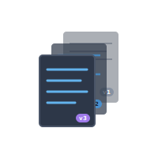

<div align="center">




**A comprehensive Python library for managing and versioning LLM prompts, with built-in A/B testing, metric tracking, and performance monitoring capabilities.**

[](https://www.python.org/downloads/)
[](https://opensource.org/licenses/MIT)
[](https://github.com/psf/black)

[Features](#-features) • [Installation](#-installation) • [Quick Start](#-quick-start) • [Web Dashboard](#-web-dashboard) • [Examples](#-examples--use-cases) • [Documentation](##)

</div>

---

## 🎯 Why Prompt Versioner?

In the rapidly evolving world of AI and Large Language Models, managing prompt versions, tracking performance, and ensuring consistent quality is crucial for production applications. **Prompt Versioner** provides enterprise-grade prompt management with:

- **🔄 Version Control**: Versioning for prompts with complete history
- **📊 Performance Tracking**: Comprehensive metrics and regression detection
- **🧪 A/B Testing**: Built-in statistical framework for prompt optimization
- **⚡ Real-time Monitoring**: Automated alerts and performance dashboards
- **👥 Team Collaboration**: Annotations, reviews, and shared insights
- **🎨 Modern UI**: Beautiful web dashboard with dark/light themes

---

## ✨ Features

### 🔧 Core Functionality
- **Versioning**: Automatic version management with MAJOR/MINOR/PATCH bumps
- **Metrics Tracking**: Comprehensive LLM call metrics (tokens, latency, quality, cost)
- **Export**: Backup and share prompts with full history
- **Git Integration**: Optional Git integration for version control

### 🧪 Advanced Testing & Monitoring
- **A/B Testing**: Built-in statistical framework for comparing prompt versions
- **Performance Monitoring**: Automated regression detection and alerting
- **Real-time Analytics**: Live metrics and performance dashboards
- **Custom Alerts**: Configure thresholds for cost, latency, and quality metrics

### 👥 Collaboration & Management
- **Team Annotations**: Collaborative notes and feedback system
- **Version Comparison**: Detailed diff views with change tracking
- **Search & Filtering**: Find prompts by metadata, performance, and tags

### 🎨 Modern Web Interface
- **Interactive Dashboard**: Beautiful, responsive web UI
- **Dark/Light Themes**: Customizable interface with modern design
- **Tab Navigation**: Organized sections for Prompts, A/B Testing, Comparisons, and Alerts
- **Real-time Updates**: Live data refresh and instant feedback


---

## 📦 Installation

### Prerequisites
- **Python 3.11** or higher
- **Poetry** (recommended) or pip
- **Git** (optional, for version control integration)

### Using Poetry (Recommended)

```bash
# Install from GitHub repository
poetry add git+https://github.com/pepes97/prompt-versioner.git

# Or clone and install locally for development
git clone https://github.com/pepes97/prompt-versioner.git
cd prompt-versioner
poetry install
```

### Using pip

```bash
# Install from GitHub repository
pip install git+https://github.com/pepes97/prompt-versioner.git

# Or clone and install locally
git clone https://github.com/pepes97/prompt-versioner.git
cd prompt-versioner
pip install -e .
```

### Verify Installation

```bash
# Check if CLI is available
pv --help

# Launch dashboard to verify web interface
pv dashboard --port 5000
```

---

## 🚀 Quick Start

### Basic Usage

> 📁 **Complete example**: [`examples/basic_usage.py`](examples/basic_usage.py)

```python
from prompt_versioner import PromptVersioner, VersionBump

# Initialize versioner
pv = PromptVersioner(project_name="my-ai-project", enable_git=False)

# Save your first prompt version
pv.save_version(
    name="code_reviewer",
    system_prompt="You are an expert code reviewer with deep knowledge of software engineering.",
    user_prompt="Review this code thoroughly:\n{code}\n\nProvide detailed feedback.",
    bump_type=VersionBump.MAJOR,  # Creates version 1.0.0
    metadata={
        "type": "code_review",
        "author": "team",
        "model_target": "gpt-4o",
        "use_case": "pull_request_review"
    }
)

# Get the latest version
latest = pv.get_latest("code_reviewer")
print(f"✅ Latest version: {latest['version']}")

# Log metrics from your LLM calls
pv.log_metrics(
    name="code_reviewer",
    version=latest["version"],
    model_name="gpt-4o",
    input_tokens=150,
    output_tokens=250,
    latency_ms=450.5,
    quality_score=0.92,
    temperature=0.7,
    max_tokens=1000,
    success=True
)

print("📊 Metrics logged successfully!")
```

### Launch Web Dashboard

> 📁 **Dashboard launcher**: [`examples/run_dashboard.py`](examples/run_dashboard.py)

```bash
# Quick start - auto-detects database in current directory
pv dashboard

# Custom configuration
pv dashboard --port 8080 --host 0.0.0.0 --project my-project

# With custom database path
pv dashboard --db-path /path/to/prompts.sqlite --port 5000
```
---

## 🎨 Web Dashboard

The modern web interface provides a comprehensive view of your prompt versions, metrics, and testing results.


### Core Features

#### 📋 **Prompts Management**
- **Version History**: Complete timeline with visual diffs
- **Semantic Search**: Find prompts by content, metadata, or version
- **Bulk Operations**: Export, compare, and manage multiple versions
- **Real-time Preview**: Live rendering of prompt templates


#### 📊 **Metrics & Analytics**
- **Performance Tracking**: Token usage, latency, cost analysis
- **Quality Monitoring**: Success rates, quality scores over time


#### 🧪 **A/B Testing**
- **Split Testing**: Compare prompt versions with statistical significance
- **Real-time Results**: Monitor test progress and early indicators


#### 🔍 **Version Comparison**
- **Visual Diff Engine**: Side-by-side prompt comparison with syntax highlighting
- **Metadata Changes**: Track parameter modifications and settings
- **Performance Delta**: Compare metrics between versions
- **Smart Annotations**: Highlight significant changes and impacts


#### ⚠️ **Smart Alerts**
- **Performance Degradation**: Automatic detection of quality drops
- **Cost Anomalies**: Unusual spending patterns and token usage
- **Error Rate Monitoring**: Success rate thresholds and notifications
- **Custom Metrics**: Define your own alert conditions


### Dashboard Themes

Switch seamlessly between **Dark Mode** and **Light Mode** with full UI consistency:

| Dark Mode | Light Mode |
|-----------|------------|
|  |  |

---

## 💻 CLI Interface

### Core Commands

```bash
# Initialize a new project
pv init

# List all prompts
pv list

# Show all versions of a specific prompt
pv versions <prompt>

Example: pv versions clause_classifier

# Show details of a specific version
pv show <nome prompt> <version>

Example: pv show clauses_classifier 1.0.0-SNAPSHOT

# Compare two versions (shows diff)
pv diff <nome prompt> <version 1> <version 2>

# Compare versions with metrics
pv compare <nome prompt> <version 1> <version 2>

# Delete a specific version
pv delete <nome prompt> <version>

# Rollback to a previous version
pv rollback <nome prompt> <version>
```

### Management Operations

```bash
# Launch web dashboard
pv dashboard --port 5000

# Git hooks management
pv install-hooks    # Install Git hooks for automatic versioning
pv uninstall-hooks  # Remove Git hooks

# Auto-versioning (used by Git hooks)
pv auto-version --pre-commit

# Database management
pv clear-db         # Clear all prompts and data from database
pv clear-db --force # Clear database without confirmation

# Standalone database cleaner (alternative)
prompt-clear                    # Clear database (auto-detect)
prompt-clear --force           # Clear without confirmation
prompt-clear --db-path /path   # Clear specific database
```

---

## 🧪 Advanced Testing & Monitoring

### 1. Version Management

> 📁 **Complete example**: [`examples/version_management.py`](examples/version_management.py)

```python
from prompt_versioner import PromptVersioner, VersionBump

# Initialize versioner
pv = PromptVersioner(project_name="my-ai-project", enable_git=False)


# Create versions with semantic versioning
pv.save_version(
    name="summarizer",
    system_prompt="You are a skilled summarization assistant.",
    user_prompt="Summarize the following text:\n{text}",
    bump_type=VersionBump.MAJOR,  # MAJOR, MINOR, or PATCH
    metadata={"type": "summarization", "improvement": "better context"}
)

# List all versions
versions = pv.list_versions("summarizer")
for v in versions:
    print(f"Version {v['version']}: {v['timestamp']}")

# Get specific version
version_1_0 = pv.get_version("summarizer", "1.0.0")

print(f"Retrieved version: {version_1_0['version']} with prompt, User Prompt:\n{version_1_0['user_prompt']}")
```

### 2. Metrics Tracking

> 📁 **Complete example**: [`examples/metrics_tracking.py`](examples/metrics_tracking.py)

```python
from prompt_versioner import PromptVersioner, VersionBump

# Initialize versioner
pv = PromptVersioner(project_name="my-ai-project", enable_git=False)


# Create versions with semantic versioning
pv.save_version(
    name="summarizer",
    system_prompt="You are a skilled summarization assistant.",
    user_prompt="Summarize the following text:\n{text}",
    bump_type=VersionBump.MAJOR,  # MAJOR, MINOR, or PATCH
    metadata={"type": "summarization", "improvement": "better context"}
)

# List all versions
versions = pv.list_versions("summarizer")
for v in versions:
    print(f"Version {v['version']}: {v['timestamp']}")

# Get specific version
version_1_0 = pv.get_version("summarizer", "1.0.0")

print(f"✅ Retrieved version: {version_1_0['version']} with prompt, User Prompt:\n{version_1_0['user_prompt']}")


# Log comprehensive metrics
pv.log_metrics(
    name="summarizer",
    version="1.0.0",
    model_name="gpt-4o",
    input_tokens=150,
    output_tokens=75,
    latency_ms=420.5,
    quality_score=0.95,
    temperature=0.7,
    max_tokens=500,
    success=True,
    metadata={"user_feedback": "excellent", "domain": "tech_news"}
)

# Query metrics
v = pv.get_version("summarizer", "1.0.0")
metrics = pv.storage.get_metrics(version_id=v["id"], limit=100)
avg_quality = sum(m['quality_score'] for m in metrics) / len(metrics)
print(f"📊 Average quality score: {avg_quality:.2f}")
```

### 3. A/B Testing Framework

> 📁 **Complete example**: [`examples/ab_testing.py`](examples/ab_testing.py)

```python
from prompt_versioner.testing import ABTest

# Create an A/B test
ab_test = ABTest(
    versioner=pv,
    prompt_name="summarizer",
    version_a="1.0.0",
    version_b="1.1.0",
    metric_name="quality_score"
)

# Simulate A/B test results in your application loop
for i in range(50):
    # Version A results (baseline)
    quality_a = simulate_llm_call_quality()  # Your LLM call here
    ab_test.log_result("a", quality_a)

    # Version B results (challenger)
    quality_b = simulate_llm_call_quality()  # Your LLM call here
    ab_test.log_result("b", quality_b)

# Check if test has enough samples
if ab_test.is_ready(min_samples=30):
    result = ab_test.get_result()
    print(f"🏆 Winner: {result.winner}")
    print(f"📈 Improvement: {result.improvement:.2f}%")
    print(f"🎯 Confidence: {result.confidence:.1%}")

    # Print detailed analysis
    ab_test.print_result()
else:
    count_a, count_b = ab_test.get_sample_counts()
    print(f"⚠️  Need more samples: A={count_a}, B={count_b}")
```

### 4. Performance Monitoring

> 📁 **Complete example**: [`examples/performance_monitoring.py`](examples/performance_monitoring.py)

```python
from prompt_versioner import PerformanceMonitor, PromptVersioner, VersionBump
import random

pv = PromptVersioner(project_name="my-ai-project", enable_git=False)

print("🚀 Creating test data for performance monitoring...")

# 1. Create a prompt with baseline version
print("\n📝 Creating baseline version...")
pv.save_version(
    name="test_classifier",
    system_prompt="You are an expert text classifier.",
    user_prompt="Classify this text: {text}",
    bump_type=VersionBump.MAJOR,
    metadata={"version_type": "baseline", "author": "team"}
)

baseline_version = pv.get_latest("test_classifier")
print(f"✅ Created baseline version: {baseline_version['version']}")

# 2. Log baseline metrics (good performance)
print("📊 Logging baseline metrics...")
for i in range(20):
    pv.log_metrics(
        name="test_classifier",
        version=baseline_version["version"],
        model_name="gpt-4o",
        input_tokens=random.randint(100, 200),
        output_tokens=random.randint(20, 50),
        latency_ms=random.uniform(300, 500),  # Good latency
        quality_score=random.uniform(0.85, 0.95),  # Good quality
        success=True,
        temperature=0.7,
        max_tokens=100
    )

print(f"✅ Logged {20} baseline metrics")

# 3. Create new version with worse performance
print("\n📝 Creating new version with performance issues...")
pv.save_version(
    name="test_classifier",
    system_prompt="You are an expert text classifier with detailed analysis capabilities.",
    user_prompt="Classify this text with detailed reasoning: {text}\n\nProvide classification and explanation:",
    bump_type=VersionBump.MINOR,
    metadata={"version_type": "detailed", "author": "team", "change": "added detailed reasoning"}
)

current_version = pv.get_latest("test_classifier")
print(f"✅ Created current version: {current_version['version']}")

# 4. Log worse metrics for new version
print("📊 Logging current metrics (with regressions)...")
for i in range(20):
    pv.log_metrics(
        name="test_classifier",
        version=current_version["version"],
        model_name="gpt-4o",
        input_tokens=random.randint(150, 300),  # More tokens
        output_tokens=random.randint(80, 150),  # Much more output
        latency_ms=random.uniform(600, 900),   # Worse latency (30%+ increase)
        quality_score=random.uniform(0.70, 0.85),  # Worse quality (10%+ decrease)
        success=random.choice([True] * 18 + [False] * 2),  # Some failures
        temperature=0.7,
        max_tokens=200
    )

print(f"✅ Logged {20} current metrics with regressions")

print("\n" + "="*60)
print("🔍 PERFORMANCE MONITORING TEST")
print("="*60)

# Set up automated monitoring
monitor = PerformanceMonitor(versioner=pv)

# Check if we have enough prompts and versions to test
prompts = pv.list_prompts()
print(f"📊 Found {len(prompts)} prompts: {prompts}")

if prompts:
    prompt_name = "test_classifier"
    versions = pv.list_versions(prompt_name)
    print(f"📋 Found {len(versions)} versions for '{prompt_name}'")

    if len(versions) >= 2:
        # Check for regressions between versions
        current_v = versions[0]["version"]  # Latest
        baseline_v = versions[1]["version"]  # Previous

        print(f"🔍 Checking regressions: {baseline_v} → {current_v}")

        # Define custom thresholds (optional)
        thresholds = {
            "cost": 0.20,      # 20% cost increase threshold
            "latency": 0.30,   # 30% latency increase threshold
            "quality": -0.10,  # 10% quality decrease threshold
            "error_rate": 0.05 # 5% error rate increase threshold
        }

        # Check for performance regressions
        alerts = monitor.check_regression(
            name=prompt_name,
            current_version=current_v,
            baseline_version=baseline_v,
            thresholds=thresholds
        )

        if alerts:
            print(f"\n⚠️  Found {len(alerts)} performance alerts:")
            for i, alert in enumerate(alerts, 1):
                print(f"   {i}. {alert.alert_type.value}: {alert.message}")
                print(f"      Baseline: {alert.baseline_value:.4f} → Current: {alert.current_value:.4f}")
                print(f"      Change: {alert.change_percent:+.1f}% (threshold: {alert.threshold:.0f}%)")
                print()
        else:
            print("✅ No performance regressions detected!")

        # Add alert handler for future monitoring
        def alert_handler(alert):
            print(f"🚨 REAL-TIME ALERT: {alert.alert_type.value} for {alert.prompt_name}")
            print(f"    {alert.message}")
            print(f"    Change: {alert.change_percent:+.1f}%")

        monitor.add_alert_handler(alert_handler)
        print("📡 Alert handler registered for future monitoring")

        # Show metrics summary
        print(f"\n📈 Metrics Summary:")
        baseline_metrics = pv.storage.get_metrics_summary(versions[1]["id"])
        current_metrics = pv.storage.get_metrics_summary(versions[0]["id"])

        if baseline_metrics and current_metrics:
            print(f"   Cost:    {baseline_metrics.get('avg_cost', 0):.4f} → {current_metrics.get('avg_cost', 0):.4f}")
            print(f"   Latency: {baseline_metrics.get('avg_latency', 0):.1f}ms → {current_metrics.get('avg_latency', 0):.1f}ms")
            print(f"   Quality: {baseline_metrics.get('avg_quality', 0):.3f} → {current_metrics.get('avg_quality', 0):.3f}")
            print(f"   Success: {baseline_metrics.get('success_rate', 0):.1%} → {current_metrics.get('success_rate', 0):.1%}")

    else:
        print("⚠️  Need at least 2 versions to check for regressions")
else:
    print("⚠️  No prompts found. Create some prompts first with basic_usage.py")

print("\n✅ Performance monitoring test complete!")
```

---

## 📖 Examples & Use Cases

> 💡 **All examples are fully functional and can be run directly!**
>
> 📂 **Examples Directory**: [`examples/`](examples/) contains complete working examples for every feature.

| Example | Description | Key Features |
|---------|-------------|--------------|
| [`basic_usage.py`](examples/basic_usage.py) | Getting started with prompt versioning | Version creation, retrieval, basic metrics |
| [`version_management.py`](examples/version_management.py) | Advanced version control operations | Semantic versioning, metadata, version comparison |
| [`metrics_tracking.py`](examples/metrics_tracking.py) | Comprehensive metrics logging | Token tracking, quality scores, cost analysis |
| [`ab_testing.py`](examples/ab_testing.py) | A/B testing framework | Statistical testing, winner determination |
| [`performance_monitoring.py`](examples/performance_monitoring.py) | Automated performance monitoring | Regression detection, alert generation |
| [`summarization_example.py`](examples/summarization_example.py) | Real-world summarization pipeline | Production-ready LLM integration |
| [`code_review.py`](examples/code_review.py) | Multi-stage code review system | Security and performance analysis |
| [`test_all_features.py`](examples/test_all_features.py) | Complete feature demonstration | End-to-end workflow testing |
| [`run_dashboard.py`](examples/run_dashboard.py) | Web dashboard launcher | Dashboard configuration and startup |
| [`clear_db.py`](examples/clear_db.py) | Database management utilities | Clean up and reset operations |

### Content Summarization Pipeline

> 📁 **Complete example**: [`examples/summarization_example.py`](examples/summarization_example.py)

```python
import openai
from prompt_versioner.core import PromptVersioner, VersionBump

# Initialize with your project
pv = PromptVersioner("content-ai", enable_git=True)

# Create a summarization prompt
pv.save_version(
    name="news_summarizer",
    system_prompt="""You are a professional news summarizer. Create concise,
    accurate summaries that capture the key points and maintain journalistic objectivity.""",
    user_prompt="""Summarize this news article in 2-3 sentences:

Article: {article_text}

Summary:""",
    bump_type=VersionBump.MAJOR,
    metadata={
        "domain": "journalism",
        "target_length": "2-3 sentences",
        "style": "objective"
    }
)

# Use in production with metrics tracking
def summarize_article(article_text: str) -> str:
    prompt_data = pv.get_latest("news_summarizer")

    # Format the prompt
    formatted_prompt = prompt_data["user_prompt"].format(article_text=article_text)

    # Call your LLM
    start_time = time.time()
    response = openai.chat.completions.create(
        model="gpt-4o",
        messages=[
            {"role": "system", "content": prompt_data["system_prompt"]},
            {"role": "user", "content": formatted_prompt}
        ],
        temperature=0.7,
        max_tokens=200
    )
    latency = (time.time() - start_time) * 1000

    # Log metrics automatically
    pv.log_metrics(
        name="news_summarizer",
        version=prompt_data["version"],
        model_name="gpt-4o",
        input_tokens=response.usage.prompt_tokens,
        output_tokens=response.usage.completion_tokens,
        latency_ms=latency,
        cost_usd=calculate_cost(response.usage),
        success=True
    )

    return response.choices[0].message.content

# Run A/B test on improvements
pv.save_version(
    name="news_summarizer",
    system_prompt="""You are a professional news summarizer with expertise in
    extracting key insights. Create engaging, concise summaries that highlight
    the most important developments.""",
    user_prompt="""Create a compelling summary of this news article:

Article: {article_text}

Key Points:
-""",
    bump_type=VersionBump.MINOR,  # Now version 1.1.0
    metadata={
        "domain": "journalism",
        "improvement": "more engaging format",
        "style": "key_points_format"
    }
)
```

### Code Review Assistant

> 📁 **Complete example**: [`examples/code_review.py`](examples/code_review.py)

```python
# Multi-stage code review system
pv = PromptVersioner("code-review-ai")

# Stage 1: Security Analysis
pv.save_version(
    name="security_reviewer",
    system_prompt="""You are a cybersecurity expert specializing in code review.
    Focus on identifying security vulnerabilities, authentication issues, and
    data exposure risks.""",
    user_prompt="""Analyze this code for security vulnerabilities:
    {language}
    {code}
    Security Analysis:
    1. Vulnerabilities Found:
    2. Risk Level (High/Medium/Low):
    3. Recommendations:""",
    bump_type=VersionBump.MAJOR,
    metadata={"stage": "security", "focus": "vulnerabilities"}
)

# Stage 2: Performance Analysis
pv.save_version(
    name="performance_reviewer",
    system_prompt="""You are a senior software engineer specializing in performance
    optimization. Identify bottlenecks, inefficient algorithms, and scalability issues.""",
    user_prompt="""Review this code for performance issues:
    {language}
    {code}

    Performance Analysis:
    1. Bottlenecks Identified:
    2. Algorithm Complexity:
    3. Optimization Suggestions:""",
    bump_type=VersionBump.MAJOR,
    metadata={"stage": "performance", "focus": "optimization"}
)

# Integrated review function
def comprehensive_code_review(code: str, language: str):
    """Run multi-stage code review with metrics tracking."""
    reviews = {}

    for review_type in ["security_reviewer", "performance_reviewer"]:
        prompt_data = pv.get_latest(review_type)

        # Format and execute
        formatted_prompt = prompt_data["user_prompt"].format(
            code=code,
            language=language
        )

        review_result = call_llm_with_metrics(
            prompt_data=prompt_data,
            user_prompt=formatted_prompt,
            review_type=review_type
        )

        reviews[review_type] = review_result

    return reviews
```

---

## 🔧 Configuration & Best Practices

### Environment Setup

Create a `.env` file for your project:

```bash
# Database Configuration
PROMPT_VERSIONER_DB_PATH=./prompts.sqlite
PROMPT_VERSIONER_PROJECT_NAME=my-ai-project

# Git Integration (optional)
PROMPT_VERSIONER_ENABLE_GIT=true
PROMPT_VERSIONER_AUTO_COMMIT=false

# Web Dashboard
PROMPT_VERSIONER_DASHBOARD_HOST=0.0.0.0
PROMPT_VERSIONER_DASHBOARD_PORT=5000
PROMPT_VERSIONER_DASHBOARD_DEBUG=false

# Monitoring
PROMPT_VERSIONER_ENABLE_ALERTS=true
PROMPT_VERSIONER_ALERT_EMAIL=admin@yourcompany.com
```

### Best Practices

> 📁 **See also**: [`examples/test_all_features.py`](examples/test_all_features.py) for complete workflow examples

#### 1. **Semantic Versioning Strategy**
```python
# MAJOR: Breaking changes to prompt logic
pv.save_version(name="code_reviewer", ..., bump_type=VersionBump.MAJOR)

# MINOR: New features or improvements
pv.save_version(name="code_reviewer", ..., bump_type=VersionBump.MINOR)

# PATCH: Bug fixes or small adjustments
pv.save_version(name="code_reviewer", ..., bump_type=VersionBump.PATCH)
```

#### 2. **Comprehensive Metadata**
```python
metadata = {
    "author": "jane.doe@company.com",
    "team": "ml-platform",
    "purpose": "customer_support",
    "model_target": "gpt-4o",
    "use_case": "ticket_classification",
    "performance_target": {"accuracy": 0.95, "latency_ms": 500},
    "reviewed_by": "senior.engineer@company.com",
    "deployment_env": "production"
}
```

#### 3. **Systematic A/B Testing**
```python
# Test incrementally - single variable changes
# Old version: Basic instruction
# New version: Add few-shot examples
# Measure: quality_score, user_satisfaction

# Always define success criteria upfront
ab_test = ABTest(
    versioner=pv,
    prompt_name="code_reviewer",
    version_a="1.0.0",
    version_b="1.0.0",
    metric_name="quality_score",
)
```

#### 4. **Production Monitoring**
```python
monitor = PerformanceMonitor(versioner=pv)

# Set up alert handler for notifications
def alert_handler(alert):
    """Handle performance alerts."""
    print(f"🚨 ALERT: {alert.alert_type.value} for {alert.prompt_name}")
    print(f"    {alert.message}")
    print(f"    Change: {alert.change_percent:+.1f}%")

    # Send to notification channels
    if alert.alert_type.value in ["COST_INCREASE", "LATENCY_INCREASE"]:
        send_slack_notification(alert)
    if alert.change_percent > 50:  # Critical alerts
        send_email_alert(alert)

monitor.add_alert_handler(alert_handler)

# Check critical prompts for regressions
critical_prompts = ["user_support", "content_moderation", "code_generation"]

for prompt_name in critical_prompts:
    versions = pv.list_versions(prompt_name)
    if len(versions) >= 2:
        alerts = monitor.check_regression(
            name=prompt_name,
            current_version=versions[0]["version"],  # Latest
            baseline_version=versions[1]["version"], # Previous
            thresholds={
                "quality": -0.10,      # 10% quality decrease
                "cost": 0.20,          # 20% cost increase
                "latency": 0.30,       # 30% latency increase
                "error_rate": 0.05     # 5% error rate increase
            }
        )

        if alerts:
            print(f"⚠️ Found {len(alerts)} alerts for {prompt_name}")
```

---

## 🌟 Contributing

We welcome contributions! Please see our [Contributing Guide](CONTRIBUTING.md) for details (TODO).

### Development Setup

```bash
# Clone the repository
git clone https://github.com/pepes97/prompt-versioner.git
cd prompt-versioner

# Install development dependencies
poetry install --with dev,test

# Install pre-commit hooks
pre-commit install

# Run tests
pytest

# Run linting
black . && isort . && flake8
```

### Running Tests

```bash
# Unit tests
pytest tests/unit/

# Integration tests
pytest tests/integration/

# End-to-end tests
pytest tests/e2e/

# Coverage report
pytest --cov=prompt_versioner --cov-report=html
```

---

## 📄 License

This project is licensed under the MIT License - see the [LICENSE](LICENSE) file for details.

---

## 📞 Support

- **Documentation**: TODO
- **Issues**: [GitHub Issues](https://github.com/pepes97/prompt-versioner/issues)
- **Discussions**: [GitHub Discussions](https://github.com/pepes97/prompt-versioner/discussions)

---

<p align="center">
  <strong>Build by Sveva Pepe, an NLP Engineer</strong><br>
  <sub>Star ⭐ this project if it helps you build better AI applications!</sub>
</p>
