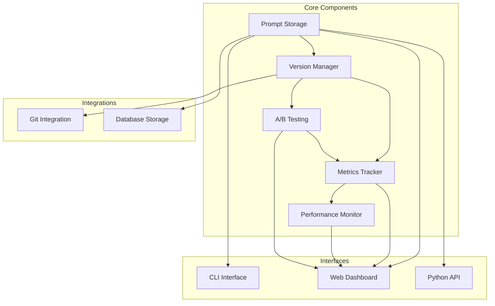
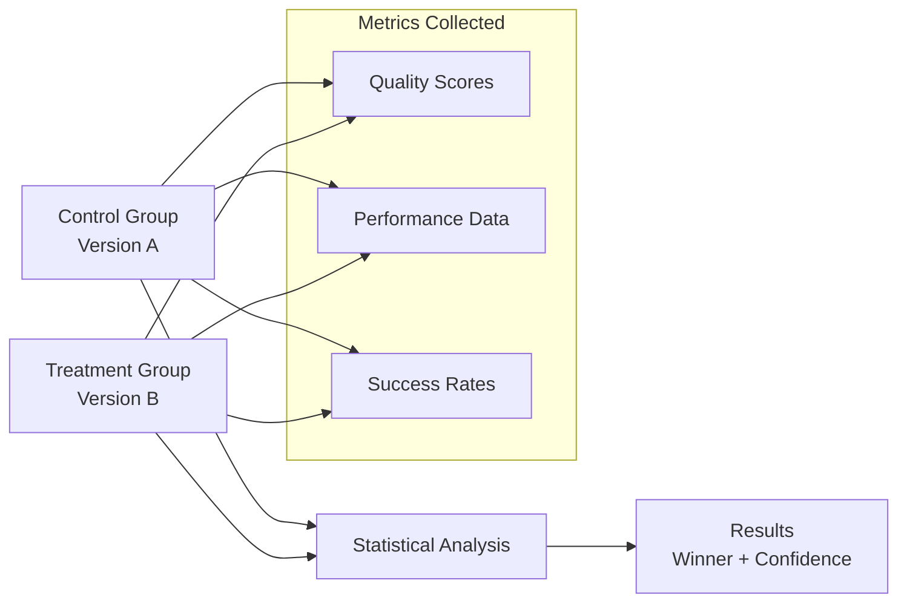

# Core Concepts

Understanding the fundamental concepts behind **Prompt Versioner** will help you effectively manage and optimize your AI prompts.

## 🏗️ Architecture Overview

Prompt Versioner provides a comprehensive framework for prompt lifecycle management:



### Component Overview

- **Prompt Storage**: Centralized repository for all prompt versions
- **Version Manager**: Semantic versioning and change tracking
- **Metrics Tracker**: Performance monitoring and analytics
- **A/B Testing**: Statistical comparison framework
- **Git Integration**: Version control synchronization
- **Multi-Interface Access**: CLI, Web dashboard, and Python API

## 📝 Prompt Structure

### Core Components

Every prompt in Prompt Versioner contains:

- **System Prompt**: AI role and behavior instructions
- **User Prompt**: Input template with variable placeholders
- **Metadata**: Versioning info, timestamps, custom attributes
- **Performance Data**: Usage metrics and quality scores

```python
# Example prompt structure
{
    "id": "uuid-string",
    "name": "assistant_prompt",
    "version": "1.2.0",
    "system_prompt": "You are a helpful assistant specializing in {domain}.",
    "user_prompt": "Please help with: {user_input}",
    "metadata": {"created_for": "customer support", "author": "team_lead"},
    "timestamp": "2025-01-15T10:30:00Z"
}
```

### Variable Templates

Use variables for dynamic, reusable prompts:

```python
from prompt_versioner import PromptVersioner, VersionBump

pv = PromptVersioner(project_name="customer-service", enable_git=False)

pv.save_version(
    name="support_assistant",
    system_prompt="You are a {role} specializing in {domain}.",
    user_prompt="Issue: {issue}\nProvide {response_type} assistance.",
    bump_type=VersionBump.MAJOR,
    metadata={"variables": ["role", "domain", "issue", "response_type"]}
)
```

## 🔄 Version Management

### Semantic Versioning System

Prompt Versioner uses semantic versioning (MAJOR.MINOR.PATCH):

| Type | Format | Use Case | Example |
|------|--------|----------|---------|
| **MAJOR** | x.0.0 | Breaking changes, complete redesigns | New prompt structure |
| **MINOR** | x.y.0 | Feature additions, improvements | Added context variables |
| **PATCH** | x.y.z | Bug fixes, minor tweaks | Grammar corrections |

### Version Operations

```python
from prompt_versioner import PromptVersioner, VersionBump

pv = PromptVersioner(project_name="my-project", enable_git=False)

# Create versions with different bump types
pv.save_version(
    name="assistant",
    system_prompt="You are a helpful assistant.",
    user_prompt="Question: {question}",
    bump_type=VersionBump.MAJOR
)

# Get version information
latest = pv.get_latest("assistant")
specific = pv.get_version("assistant", "1.0.0")
all_versions = pv.list_versions("assistant")

# Compare versions
diff = pv.diff("assistant", "1.0.0", "2.0.0", format_output=True)
```

## 📊 Metrics and Performance

### Key Performance Indicators

Track essential metrics for prompt optimization:

| Metric | Description | Optimal Range |
|--------|-------------|---------------|
| **Quality Score** | Human or AI assessment (0-1) | > 0.8 |
| **Latency** | Response time in milliseconds | < 3000ms |
| **Cost** | Token usage cost in euros | Varies by model |
| **Success Rate** | Successful request percentage | > 95% |

### Logging Metrics

```python
# Log performance data
pv.log_metrics(
    name="assistant",
    version="1.1.0",
    model_name="gpt-4o-mini",
    input_tokens=150,
    output_tokens=200,
    latency_ms=1500,
    cost_eur=0.004,
    quality_score=0.85,
    success=True,
    metadata={"domain": "customer_service"}
)

# Analyze performance
version_data = pv.get_version("assistant", "1.1.0")
metrics = pv.storage.get_metrics(version_id=version_data["id"])

if metrics:
    avg_quality = sum(m.get("quality_score", 0) for m in metrics) / len(metrics)
    avg_latency = sum(m.get("latency_ms", 0) for m in metrics) / len(metrics)
    print(f"Average quality: {avg_quality:.2f}")
    print(f"Average latency: {avg_latency:.0f}ms")
```

## 🧪 A/B Testing Framework

### Statistical Testing Structure

A/B testing framework with built-in statistical analysis:



### Implementation

```python
from prompt_versioner import ABTest

# Create A/B test
ab_test = ABTest(
    versioner=pv,
    prompt_name="customer_service",
    version_a="1.0.0",  # Control
    version_b="1.1.0",  # Treatment
    metric_name="quality_score"
)

# Log test results for both groups
for i in range(30):
    ab_test.log_result("a", 0.75 + (i * 0.005))  # Control baseline
    ab_test.log_result("b", 0.80 + (i * 0.005))  # Treatment improvement

# Get statistical results
if ab_test.is_ready(min_samples=25):
    result = ab_test.get_result()
    print(f"Winner: Version {result.winner}")
    print(f"Improvement: {result.improvement:.1%}")
    print(f"Confidence: {result.confidence:.1%}")
```

### Key Features

- **Statistical Significance**: Automatic p-value calculation
- **Sample Size Validation**: Ensures reliable results
- **Confidence Intervals**: Quantifies uncertainty
- **Clear Recommendations**: Winner determination with confidence levels

## ⚠️ Monitoring and Alerts

### Performance Thresholds

Set up monitoring with configurable thresholds:

| Metric | Warning | Critical |
|--------|---------|----------|
| Quality Score | < 0.8 | < 0.6 |
| Latency | > 3000ms | > 5000ms |
| Success Rate | < 98% | < 95% |
| Cost per Request | > €0.01 | > €0.02 |

### Basic Monitoring

```python
def monitor_performance(pv, prompt_name, version, min_samples=20):
    """Monitor prompt performance with threshold alerts"""

    version_data = pv.get_version(prompt_name, version)
    metrics = pv.storage.get_metrics(version_id=version_data["id"])

    if len(metrics) < min_samples:
        print(f"⏳ Need {min_samples - len(metrics)} more samples")
        return

    # Calculate averages from recent metrics
    recent = metrics[-min_samples:]
    avg_quality = sum(m.get("quality_score", 0) for m in recent) / len(recent)
    avg_latency = sum(m.get("latency_ms", 0) for m in recent) / len(recent)
    success_rate = sum(1 for m in recent if m.get("success", True)) / len(recent)

    # Check thresholds and alert
    alerts = []
    if avg_quality < 0.7: alerts.append(f"Low quality: {avg_quality:.2f}")
    if avg_latency > 3000: alerts.append(f"High latency: {avg_latency:.0f}ms")
    if success_rate < 0.95: alerts.append(f"Low success: {success_rate:.1%}")

    if alerts:
        print(f"🚨 {prompt_name} v{version} alerts: {', '.join(alerts)}")
    else:
        print(f"✅ {prompt_name} v{version} healthy")

# Usage
monitor_performance(pv, "customer_service", "1.1.0")
```
## 🤝 Collaboration and Organization

### Team Annotations

Enable team collaboration with structured annotations:

```python
# Add team annotations for reviews and approvals
pv.add_annotation(
    name="customer_service",
    version="1.1.0",
    text="Approved for production deployment after A/B testing",
    author="team_lead"
)

# Read all team annotations
annotations = pv.get_annotations("customer_service", "1.1.0")
for note in annotations:
    print(f"{note['author']}: {note['text']}")
```

### Prompt Organization

Structure prompts using naming conventions and metadata:

```python
# Organized naming convention: domain_subdomain_type
prompt_types = [
    "customer_support_general",
    "customer_support_technical",
    "marketing_email_campaigns",
    "marketing_social_media",
    "internal_qa_automation"
]

# Find prompts by domain
def find_prompts_by_domain(pv, domain):
    all_prompts = pv.list_prompts()
    return [name for name in all_prompts if name.startswith(f"{domain}_")]

customer_prompts = find_prompts_by_domain(pv, "customer")
marketing_prompts = find_prompts_by_domain(pv, "marketing")
```

### Version History Tracking

```python
# Get comprehensive version history
versions = pv.list_versions("customer_service")
for v in versions:
    print(f"v{v['version']} - {v['timestamp']}")

# Compare version changes
diff = pv.diff("customer_service", "1.0.0", "1.1.0", format_output=True)
print(f"Changes: {diff.summary}")
```

### Git Integration

Synchronize with version control:

```python
# Enable Git tracking
pv_git = PromptVersioner(
    project_name="git-tracked",
    enable_git=True,
    git_repo="/path/to/repo"
)

# Install hooks for automatic tracking
pv_git.install_git_hooks()

# Prompt changes are now tracked in Git
pv_git.save_version(
    name="tracked_prompt",
    system_prompt="You are a helpful assistant.",
    user_prompt="Help with: {request}",
    bump_type=VersionBump.MAJOR
)
```

### Backup and Export

```python
from pathlib import Path

# Export prompts for backup
pv.export_prompt(
    name="customer_service",
    output_file=Path("backups/customer_service.json"),
    format="json",
    include_metrics=True
)

# Import from backup
result = pv.import_prompt(
    input_file=Path("backups/customer_service.json"),
    overwrite=False
)
```

## 📚 Next Steps

Now that you understand the core concepts, explore these advanced topics:

- **[Version Management](version-management.md)**: Deep dive into semantic versioning strategies
- **[A/B Testing Guide](ab-testing.md)**: Advanced statistical testing techniques
- **[Performance Monitoring](performance-monitoring.md)**: Monitoring prompts
- **[Team Workflows](collaboration.md)**: Set up collaborative prompt development
- **[API Reference](../api-reference/core/versioner.md)**: Complete method documentation
