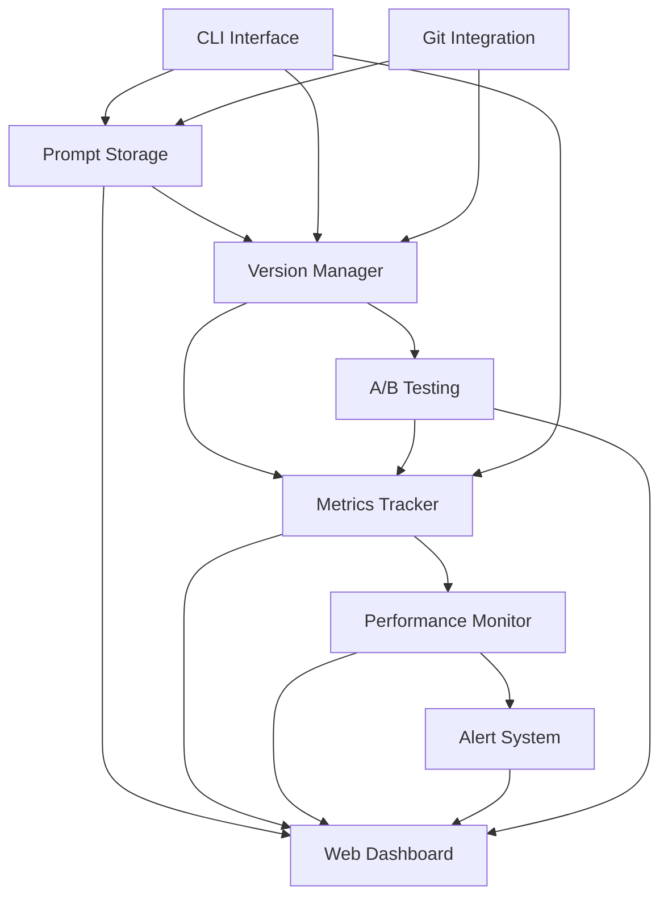

# Core Concepts

Understanding the fundamental concepts behind **Prompt Versioner** will help you make the most of its powerful features.

## 🏗️ Architecture Overview

Prompt Versioner is built around several core components that work together to provide comprehensive prompt management:



## 📝 Prompts

### What is a Prompt?

A **prompt** in Prompt Versioner is more than just text—it's a complete specification that includes:

- **Content**: The actual prompt text with variable placeholders
- **Variables**: Named parameters that can be substituted
- **Metadata**: Tags, descriptions, and custom attributes
- **Version History**: Complete change tracking
- **Performance Data**: Metrics from real usage

### Prompt Structure

```python
{
    "id": "550e8400-e29b-41d4-a716-446655440000",
    "content": "You are a {role}. Please {task}: {input}",
    "variables": {
        "role": "helpful assistant",
        "task": "summarize",
        "input": "Lorem ipsum..."
    },
    "tags": ["assistant", "summarization"],
    "description": "Multi-purpose assistant prompt",
    "created_at": "2025-01-15T10:30:00Z",
    "current_version": "1.2.0"
}
```

### Variable System

Variables make prompts reusable and dynamic:

```python
# Template with variables
content = "You are a {role} specializing in {domain}. {instruction}"

# Multiple use cases with same template
variables_customer_service = {
    "role": "customer service representative",
    "domain": "e-commerce support",
    "instruction": "Help the customer resolve their issue."
}

variables_technical_support = {
    "role": "technical support specialist",
    "domain": "software troubleshooting",
    "instruction": "Diagnose and solve the technical problem."
}
```

## 🔄 Version Management

### Semantic Versioning

Prompt Versioner uses semantic versioning (MAJOR.MINOR.PATCH) to track changes:

- **MAJOR** (1.0.0 → 2.0.0): Breaking changes that significantly alter prompt behavior
- **MINOR** (1.0.0 → 1.1.0): New features or improvements that are backward compatible
- **PATCH** (1.0.0 → 1.0.1): Bug fixes or minor refinements

### Version Types

```python
# PATCH: Minor wording improvements
versioner.create_version(
    prompt_id=prompt_id,
    content="You are a helpful assistant. Please answer: {question}",  # Fixed typo
    bump_type="patch",
    description="Fixed grammar in prompt"
)

# MINOR: Enhanced functionality
versioner.create_version(
    prompt_id=prompt_id,
    content="You are a helpful assistant with expertise in {domain}. Please answer: {question}",
    bump_type="minor",
    description="Added domain specialization"
)

# MAJOR: Complete redesign
versioner.create_version(
    prompt_id=prompt_id,
    content="System: {system_role}\nContext: {context}\nQuery: {question}\nResponse:",
    bump_type="major",
    description="Restructured to use system/context/query format"
)
```

### Version Lifecycle

Each version goes through several stages:

1. **Development**: Being created and tested
2. **Testing**: Under A/B test evaluation
3. **Production**: Actively used in production
4. **Deprecated**: Scheduled for retirement
5. **Archived**: No longer used but kept for reference

## 📊 Metrics and Performance

### Core Metrics

Prompt Versioner tracks essential performance indicators:

```python
# Token Usage
input_tokens: int      # Tokens in the prompt
output_tokens: int     # Tokens in the response
total_tokens: int      # Combined token count

# Performance
latency: float         # Response time in seconds
cost: float           # Estimated cost in USD

# Quality
quality_score: float   # 0-1 quality assessment
error_rate: float     # Rate of failed requests
```

### Quality Assessment

Quality can be measured through multiple approaches:

```python
# Manual quality scoring
versioner.track_metrics(
    prompt_id=prompt_id,
    version="1.1.0",
    quality_score=0.85,  # Human assessment
    quality_metadata={
        "reviewer": "expert_user",
        "criteria": "accuracy,helpfulness,clarity"
    }
)

# Automated quality scoring
from prompt_versioner.metrics import AutoQualityScorer

scorer = AutoQualityScorer(model="sentiment-analysis")
quality_score = scorer.score(prompt_response)
```

### Performance Baselines

Establish performance baselines for comparison:

```python
# Set baseline for a prompt
versioner.set_baseline(
    prompt_id=prompt_id,
    version="1.0.0",
    metrics={
        "target_latency": 2.0,
        "target_quality": 0.8,
        "max_cost_per_1k_tokens": 0.02
    }
)

# Compare current performance to baseline
performance = versioner.compare_to_baseline(prompt_id, "1.2.0")
print(f"Quality improvement: {performance.quality_delta:.2%}")
print(f"Latency change: {performance.latency_delta:.2f}s")
```

## 🧪 A/B Testing Framework

### Test Philosophy

A/B testing in Prompt Versioner follows rigorous statistical principles:

- **Hypothesis-driven**: Each test has a clear hypothesis
- **Statistical validity**: Proper sample sizes and significance testing
- **Practical significance**: Focus on meaningful improvements
- **Controlled experiments**: Isolate variables being tested

### Test Structure

```python
from prompt_versioner.testing import ABTest

test = ABTest(
    name="Customer Service Tone Experiment",
    hypothesis="More empathetic language improves customer satisfaction",
    primary_metric="quality_score",
    minimum_detectable_effect=0.05,  # 5% improvement
    confidence_level=0.95,
    statistical_power=0.8
)

# Add control group (current version)
test.add_variant(
    name="control",
    prompt_id=prompt_id,
    version="1.0.0",
    traffic_percentage=50,
    description="Current production prompt"
)

# Add treatment group (new version)
test.add_variant(
    name="empathetic",
    prompt_id=prompt_id,
    version="1.1.0",
    traffic_percentage=50,
    description="Enhanced with empathetic language"
)
```

### Statistical Analysis

The framework provides comprehensive statistical analysis:

```python
# Get test results
results = test.get_results()

print(f"Control group performance: {results.control.mean_quality:.3f}")
print(f"Treatment group performance: {results.treatment.mean_quality:.3f}")
print(f"Difference: {results.difference:.3f} ({results.difference_percentage:.1%})")
print(f"Statistical significance: p={results.p_value:.4f}")
print(f"Confidence interval: [{results.ci_lower:.3f}, {results.ci_upper:.3f}]")

# Decision recommendation
if results.is_significant and results.practical_significance:
    print("✅ Recommend deploying the new version")
elif results.is_significant:
    print("⚠️ Statistically significant but may not be practically significant")
else:
    print("❌ No significant improvement detected")
```

## ⚠️ Monitoring and Alerts

### Alert System

The monitoring system watches for performance regressions and anomalies:

```python
from prompt_versioner.alerts import AlertRule

# Define alert rules
rules = [
    AlertRule(
        name="Quality Regression",
        condition="quality_score < baseline.quality_score * 0.9",
        severity="error",
        description="Quality has dropped by more than 10%"
    ),
    AlertRule(
        name="High Latency",
        condition="latency > 5.0",
        severity="warning",
        description="Response time exceeds 5 seconds"
    ),
    AlertRule(
        name="Cost Spike",
        condition="cost > baseline.cost * 2.0",
        severity="warning",
        description="Cost has doubled compared to baseline"
    )
]
```

### Regression Detection

Automated detection of performance regressions:

```python
# Enable regression monitoring
versioner.enable_regression_monitoring(
    prompt_id=prompt_id,
    window_size=100,  # Monitor last 100 requests
    sensitivity=0.1,  # 10% change threshold
    metrics=["quality_score", "latency", "cost"]
)

# Get regression alerts
regressions = versioner.get_active_regressions()
for regression in regressions:
    print(f"⚠️ Regression detected in {regression.metric}")
    print(f"   Baseline: {regression.baseline:.3f}")
    print(f"   Current: {regression.current:.3f}")
    print(f"   Change: {regression.change_percentage:.1%}")
```

## 🤝 Collaboration Features

### Annotations System

Team collaboration through annotations:

```python
# Add annotation to a prompt version
versioner.add_annotation(
    prompt_id=prompt_id,
    version="1.1.0",
    content="This version works well for technical queries but may be too complex for general users",
    author="product_manager",
    tags=["feedback", "user-testing"]
)

# Add review annotation
versioner.add_annotation(
    prompt_id=prompt_id,
    version="1.1.0",
    content="Approved for A/B testing in customer service domain",
    author="team_lead",
    tags=["approval", "testing"],
    annotation_type="review"
)
```

### Change Tracking

Complete audit trail of all changes:

```python
# Get change history
history = versioner.get_change_history(prompt_id)

for change in history:
    print(f"Version {change.version} by {change.author}")
    print(f"  Change: {change.bump_type}")
    print(f"  Description: {change.description}")
    print(f"  Timestamp: {change.created_at}")
    print(f"  Files changed: {len(change.file_changes)}")
```

## 🔍 Search and Discovery

### Tagging System

Organize prompts with tags for easy discovery:

```python
# Hierarchical tags
tags = [
    "domain:customer-service",
    "type:assistant",
    "language:english",
    "version:production",
    "team:support"
]

# Search by tags
prompts = versioner.search_prompts(
    tags=["domain:customer-service", "version:production"],
    tag_operator="AND"  # Must have ALL tags
)
```

### Advanced Search

Powerful search capabilities:

```python
# Search by multiple criteria
results = versioner.search_prompts(
    content_contains="helpful assistant",
    tags=["production"],
    quality_score_min=0.8,
    created_after="2025-01-01",
    has_active_tests=True,
    sort_by="quality_score",
    sort_order="desc"
)
```

## 🔐 Security and Access Control

### Data Protection

- **Encryption**: Database encryption for sensitive prompts
- **Masking**: Automatic masking of sensitive variables
- **Audit Logging**: Complete audit trail of all actions
- **Access Control**: Role-based permissions

### Role-Based Access

```python
# Define user roles
roles = {
    "viewer": ["read"],
    "editor": ["read", "write"],
    "admin": ["read", "write", "delete", "admin"]
}

# Check permissions
if versioner.has_permission(user_id, "write", prompt_id):
    # Allow edit
    pass
```

## 🔄 Integration Patterns

### Git Integration

Seamless integration with version control:

```python
# Auto-commit prompt changes
versioner.enable_git_tracking(
    repository_path="/path/to/git/repo",
    auto_commit=True,
    branch="prompts"
)
```

### CI/CD Integration

Integrate with continuous deployment:

```python
# Export prompts for deployment
versioner.export_for_deployment(
    environment="production",
    format="json",
    include_metrics=True
)
```

Understanding these core concepts will help you leverage Prompt Versioner's full capabilities. Next, explore [version management](version-management.md) in detail.
